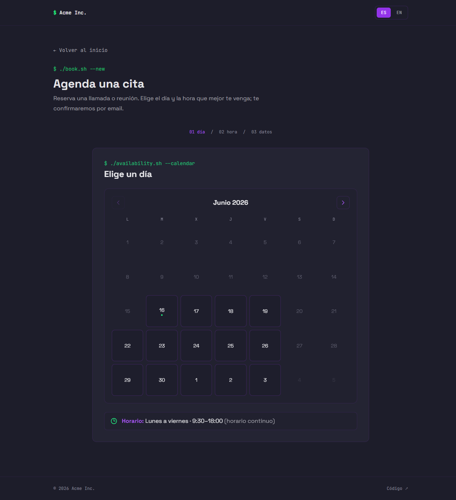

# Laravel Appointments

> **English** | [Español](#-español)
>
> An open-source, self-hosted appointment booking system built with Laravel. Clients book a slot through a wizard; you confirm or reject from email **or** Telegram; confirmed online meetings get an automatic Google Meet link.

---

## 🇬🇧 English

### Table of contents

- [Features](#features)
- [Screenshots](#screenshots)
- [Requirements](#requirements)
- [Quick start](#quick-start)
- [Configuration](#configuration)
- [Google Calendar + Meet (optional)](#google-calendar--meet-optional)
- [Telegram bot (optional)](#telegram-bot-optional)
- [The admin panel](#the-admin-panel)
- [Deployment](#deployment)
- [Customizing](#customizing)
- [How it works](#how-it-works)
- [License](#license)
- [Credits](#credits)

### Features

- **Booking wizard** — a clean, step-by-step form for the client to pick day, time, duration and details.
- **Availability calendar** — only offers real free slots: it merges your existing bookings *and* your own Google Calendar events, skips past hours, weekends, blocked days and times that would run past closing.
- **Online or in-person** — online meetings get an **automatic Google Meet link**; in-person meetings are plain calendar events. You choose which modalities to offer.
- **Confirm / reject by email AND Telegram** — get an instant alert and resolve the booking from your phone with two buttons, or manage everything from the web panel.
- **Admin panel with password** — a private `/panel` (single shared password) to see bookings, confirm/cancel them and block days.
- **Blocked days (holidays)** — mark vacation/closed days so they never get offered.
- **Add to calendar (.ics)** — every booking has a downloadable `.ics` file for Outlook / Apple Calendar.
- **Bilingual ES / EN** — the booking UI and the emails auto-detect and remember the client's language.
- **Light / dark theme** — both ship in; the visitor can toggle (sun/moon) and their choice is remembered.
- **Everything configurable** — branding, schedule, durations, modalities, timezone, reference prefix and theme all live in `config/appointments.php` and your `.env`.
- **Graceful degradation** — Google and Telegram are **optional**. Without them, bookings still work; you just manage them from the panel and online meetings get no auto Meet link.

### Screenshots

> Images live in `docs/img/`. Drop your own screenshots there with these exact names and they will render below.


*The client booking wizard (`/citas`).*


*The availability calendar picking day and time.*


*The private admin panel (`/panel`).*


*The Telegram alert with the confirm / reject buttons.*

### Requirements

- **PHP 8.3+** (the project requires `^8.3`)
- **Composer**
- **Node 18+ and npm** (to build the front-end assets)
- **A database** — SQLite by default (zero config), or MySQL / PostgreSQL if you prefer
- **Google Cloud** project — *optional* (only for Calendar + Meet)
- **Telegram bot** — *optional* (only for phone notifications)

### Quick start

```bash
# 1. Clone the repository / Clona el repositorio
git clone https://github.com/zeroit789/meetcita.git meetcita
cd laravel-appointments

# 2. Install PHP dependencies / Instala las dependencias PHP
composer install

# 3. Create your environment file from the example / Crea tu .env desde el ejemplo
cp .env.example .env

# 4. Generate the application key / Genera la clave de la aplicación
php artisan key:generate

# 5. Create the SQLite database file (default driver) / Crea el fichero SQLite (driver por defecto)
#    On Windows PowerShell use: New-Item database/database.sqlite -ItemType File
touch database/database.sqlite

# 6. Run the migrations (creates the tables) / Ejecuta las migraciones (crea las tablas)
php artisan migrate

# 7. Install front-end dependencies / Instala las dependencias del front
npm install

# 8. Build the assets (CSS/JS) / Compila los assets (CSS/JS)
npm run build

# 9. Serve the app locally / Levanta la app en local
php artisan serve
```

Now open **http://localhost:8000/citas** to make a booking and **http://localhost:8000/panel** for the admin panel.

> Tip: for active development, `composer dev` runs the server, the queue, the live logs and the Vite dev server all at once.

### Configuration

Fill these in your `.env`. **None are required to boot** (the system degrades gracefully), but you need them for the full experience. The same values can also be read/overridden in `config/appointments.php`, which is heavily commented.

| Variable | What it does | Example |
|---|---|---|
| `APP_NAME` | Application name (used in mail "from" name). | `"Appointments"` |
| `APP_ENV` | Environment. Use `production` when you go live. | `local` |
| `APP_DEBUG` | Show detailed errors. **Set `false` in production.** | `true` |
| `APP_URL` | Public base URL. Must be your real HTTPS domain in prod (Telegram webhook uses it). | `http://localhost` |
| `APP_LOCALE` | Default UI language: `es` or `en`. | `es` |
| `DB_CONNECTION` | Database driver. `sqlite` (default), `mysql` or `pgsql`. | `sqlite` |
| `MAIL_MAILER` | Mail transport. `log` writes mails to the log; use `smtp` to actually send. | `log` |
| `MAIL_FROM_ADDRESS` | The "from" address of the emails. | `"hello@example.com"` |
| `APPOINTMENTS_BRAND` | Your company / brand name (shown in emails and events). | `"Acme Inc."` |
| `APPOINTMENTS_OWNER_NAME` | Person who attends the meetings (email signature). | `"Jane Doe"` |
| `APPOINTMENTS_OWNER_ROLE` | Role/title shown in the email signature. | `"Founder"` |
| `APPOINTMENTS_OWNER_EMAIL` | **Receives the "new appointment" alerts** and is used as Reply-To. | `"hello@example.com"` |
| `APPOINTMENTS_WEBSITE` | Your public website (used in emails / calendar description). | `"https://example.com"` |
| `APPOINTMENTS_LINKEDIN` | Optional LinkedIn (or any) URL for the signature. Empty = hidden. | *(empty)* |
| `APPOINTMENTS_REF_PREFIX` | Prefix of the public booking code (e.g. `APT-K7P3Q`). 2-4 letters. | `APT` |
| `APPOINTMENTS_TIMEZONE` | Business time zone (a valid PHP tz id). ALL hours are computed here. | `Europe/Madrid` |
| `APPOINTMENTS_DAYS_AHEAD` | How many working days ahead to offer. | `14` |
| `APPOINTMENTS_OPEN` | Opening time (first possible start). | `09:30` |
| `APPOINTMENTS_CLOSE` | Closing time (exclusive — no meeting ends after this). | `18:00` |
| `APPOINTMENTS_MAX_ATTENDEES` | Max extra guests a client may invite. | `10` |
| `APPOINTMENTS_MODALITY_ONLINE` | Offer online meetings (auto Meet link). At least one modality must be true. | `true` |
| `APPOINTMENTS_MODALITY_IN_PERSON` | Offer in-person meetings. | `true` |
| `APPOINTMENTS_PANEL_PASSWORD` | **Password for the `/panel` admin area.** No default — set a strong one. | *(empty — set it!)* |
| `APPOINTMENTS_THEME` | Default theme: `dark`, `light` or `auto` (follow the OS). Visitor can still toggle. | `dark` |
| `GOOGLE_CLIENT_ID` | Google OAuth client id. *(optional)* | *(empty)* |
| `GOOGLE_CLIENT_SECRET` | Google OAuth client secret. *(optional)* | *(empty)* |
| `GOOGLE_REFRESH_TOKEN` | Refresh token from `php artisan google:auth`. *(optional)* | *(empty)* |
| `GOOGLE_CALENDAR_ID` | Target calendar. `primary` or a specific calendar id. | `primary` |
| `GOOGLE_REDIRECT_URI` | OAuth redirect URI. Must match the one in Google Cloud. | `http://localhost` |
| `TELEGRAM_BOT_TOKEN` | Bot token from @BotFather. *(optional)* | *(empty)* |
| `TELEGRAM_CHAT_ID` | Your own chat id (where alerts arrive). *(optional)* | *(empty)* |
| `TELEGRAM_WEBHOOK_SECRET` | A random string you invent (secures the webhook). *(optional)* | *(empty)* |

What lives where (a quick map of `config/appointments.php`):

- **Branding** — brand name, owner name & role, owner email, website, LinkedIn.
- **Reference prefix** — the public booking code prefix (`APT` → `APT-K7P3Q`).
- **Schedule** — `days_ahead`, `slot_minutes` (30), `open`, `close`, `durations` (`[30, 60]`), `weekdays` (ISO `1`=Mon…`7`=Sun, default Mon-Fri), `max_attendees`.
- **Modalities** — `online` / `in_person` toggles (at least one true).
- **Panel** — the admin password.
- **Locales** — supported languages (`['es', 'en']`) and the default.
- **Timezone** — the business time zone.
- **Theme** — default colour scheme.

### Google Calendar + Meet (optional)

Connect a Google account so confirmed bookings appear in your calendar and online meetings get an automatic Google Meet link. The system also reads your calendar to avoid offering slots you're already busy in.

If you don't configure it, everything still works — there's just no calendar sync and no auto Meet link.

👉 **Full step-by-step guide: [docs/GOOGLE.md](docs/GOOGLE.md)**

### Telegram bot (optional)

Get an instant alert on your phone for every new booking, with two buttons: **Confirm** (sends the confirmation email + creates the calendar event) and **Not possible** (asks you for a reason, which is emailed to the client as the cancellation). Without it, you manage everything from `/panel`.

👉 **Full step-by-step guide: [docs/TELEGRAM.md](docs/TELEGRAM.md)**

### The admin panel

- Go to **`/panel`** (e.g. `http://localhost:8000/panel`).
- Log in with the password you set in `APPOINTMENTS_PANEL_PASSWORD`. It's a single shared password — it does **not** use a users table.
- From the panel you can: **see all bookings**, **confirm** them, **cancel** them, and **block days** (holidays / closed days) so they're never offered.
- Login is rate-limited (max 5 attempts/minute per IP) to deter brute force.

### Deployment

A few things to remember when going live:

1. **Build the assets**: `npm run build`.
2. **Production environment**: set `APP_ENV=production` and `APP_DEBUG=false` in your `.env`.
3. **Emails are queued** (the mailables implement `ShouldQueue`), so something must process the queue. Pick one:
   - **Scheduler (recommended, built in):** the project already schedules a queue worker every minute (`routes/console.php`). Just run the Laravel scheduler — either `php artisan schedule:work` (foreground, for testing) or a single cron entry in production:
     ```bash
     # crontab -e — runs the Laravel scheduler every minute
     * * * * * cd /path-to-your-project && php artisan schedule:run >> /dev/null 2>&1
     ```
   - **Dedicated worker:** alternatively run a long-lived worker yourself:
     ```bash
     php artisan queue:work --tries=3
     ```
4. **Public HTTPS** is required for the Telegram webhook (set `APP_URL` to it).
5. Run `php artisan migrate --force` on the server to apply migrations.

### Customizing

- **Behaviour & branding** → edit `config/appointments.php` (every option is commented) or the matching `.env` variables (see [Configuration](#configuration)).
- **Accent colour** → edit `resources/css/app.css`, section **RE-THEME** (clearly marked with ⭐). It's the *only* place you need to touch to change the colour. Example: blue → `--accent: #2563eb; --accent-glow: #3b82f6;`. Run `npm run build` afterwards.
- **Default theme** → `APPOINTMENTS_THEME` (`dark` / `light` / `auto`). Visitors can still toggle it themselves.

### How it works

1. A client books a slot in the wizard at `/citas` (only real free slots are offered).
2. You get an alert by **email** and (if configured) **Telegram**.
3. You **confirm** or **reject** — from the Telegram buttons or the `/panel`.
4. On confirm: the client gets a confirmation email, and a **Google Calendar event** is created (with a **Meet link** if the meeting is online).
5. On reject: you type a reason, and the client receives it by email; any calendar event is removed.

### License

[MIT](LICENSE).

### Credits

Made by **ZeroIT** — [danimefle.com](https://danimefle.com).

---
---

## 🇪🇸 Español

> [English](#-english) | **Español**

Sistema de **reserva de citas** open-source y self-hosted hecho con Laravel. El cliente reserva un hueco con un asistente paso a paso; tú confirmas o rechazas desde el email **o** desde Telegram; las citas online confirmadas reciben un enlace de Google Meet automático.

### Índice

- [Características](#características)
- [Capturas](#capturas)
- [Requisitos](#requisitos)
- [Instalación rápida](#instalación-rápida)
- [Configuración](#configuración)
- [Google Calendar + Meet (opcional)](#google-calendar--meet-opcional)
- [Bot de Telegram (opcional)](#bot-de-telegram-opcional)
- [El panel de administración](#el-panel-de-administración)
- [Despliegue](#despliegue)
- [Personalización](#personalización)
- [Cómo funciona](#cómo-funciona)
- [Licencia](#licencia)
- [Créditos](#créditos)

### Características

- **Asistente de reserva (wizard)** — un formulario limpio, paso a paso, para que el cliente elija día, hora, duración y datos.
- **Calendario de disponibilidad** — solo ofrece huecos realmente libres: fusiona tus citas existentes *y* los eventos de tu propio Google Calendar, descarta horas pasadas, fines de semana, días bloqueados y horas que terminarían después del cierre.
- **Online o presencial** — las citas online obtienen un **enlace de Google Meet automático**; las presenciales son eventos de calendario normales. Tú eliges qué modalidades ofrecer.
- **Confirmar / rechazar por email Y por Telegram** — recibe un aviso al instante y resuelve la cita desde el móvil con dos botones, o gestiónalo todo desde el panel web.
- **Panel de administración con contraseña** — un `/panel` privado (contraseña única compartida) para ver las citas, confirmarlas/cancelarlas y bloquear días.
- **Días bloqueados (vacaciones)** — marca días de vacaciones/cierre para que nunca se ofrezcan.
- **Añadir al calendario (.ics)** — cada cita tiene un fichero `.ics` descargable para Outlook / Apple Calendar.
- **Bilingüe ES / EN** — la UI de reservas y los emails autodetectan y recuerdan el idioma del cliente.
- **Tema claro / oscuro** — vienen ambos; el visitante puede cambiarlo (sol/luna) y su elección se recuerda.
- **Todo configurable** — marca, horario, duraciones, modalidades, zona horaria, prefijo de referencia y tema viven en `config/appointments.php` y tu `.env`.
- **Degradación con gracia** — Google y Telegram son **opcionales**. Sin ellos, las citas siguen funcionando; solo que las gestionas desde el panel y las citas online no obtienen enlace de Meet automático.

### Capturas

> Las imágenes van en `docs/img/`. Deja ahí tus propias capturas con estos nombres exactos y se mostrarán abajo.


*El asistente de reserva del cliente (`/citas`).*


*El calendario de disponibilidad eligiendo día y hora.*


*El panel de administración privado (`/panel`).*


*El aviso de Telegram con los botones de confirmar / rechazar.*

### Requisitos

- **PHP 8.3+** (el proyecto requiere `^8.3`)
- **Composer**
- **Node 18+ y npm** (para compilar los assets del front)
- **Una base de datos** — SQLite por defecto (sin configuración), o MySQL / PostgreSQL si lo prefieres
- **Proyecto de Google Cloud** — *opcional* (solo para Calendar + Meet)
- **Bot de Telegram** — *opcional* (solo para los avisos al móvil)

### Instalación rápida

```bash
# 1. Clona el repositorio
git clone https://github.com/zeroit789/meetcita.git meetcita
cd laravel-appointments

# 2. Instala las dependencias PHP
composer install

# 3. Crea tu .env a partir del ejemplo
cp .env.example .env

# 4. Genera la clave de la aplicación
php artisan key:generate

# 5. Crea el fichero SQLite (driver por defecto)
#    En Windows PowerShell usa: New-Item database/database.sqlite -ItemType File
touch database/database.sqlite

# 6. Ejecuta las migraciones (crea las tablas)
php artisan migrate

# 7. Instala las dependencias del front
npm install

# 8. Compila los assets (CSS/JS)
npm run build

# 9. Levanta la app en local
php artisan serve
```

Ahora abre **http://localhost:8000/citas** para reservar y **http://localhost:8000/panel** para el panel.

> Truco: para desarrollar, `composer dev` arranca a la vez el servidor, la cola, los logs en vivo y el servidor de Vite.

### Configuración

Rellena esto en tu `.env`. **Nada es obligatorio para arrancar** (el sistema degrada con gracia), pero lo necesitas para la experiencia completa. Los mismos valores se pueden leer/sobreescribir en `config/appointments.php`, que está muy comentado.

| Variable | Qué hace | Ejemplo |
|---|---|---|
| `APP_NAME` | Nombre de la aplicación (se usa como nombre del "from" del correo). | `"Appointments"` |
| `APP_ENV` | Entorno. Usa `production` al publicar. | `local` |
| `APP_DEBUG` | Muestra errores detallados. **Ponlo en `false` en producción.** | `true` |
| `APP_URL` | URL base pública. En producción debe ser tu dominio HTTPS real (el webhook de Telegram lo usa). | `http://localhost` |
| `APP_LOCALE` | Idioma por defecto de la UI: `es` o `en`. | `es` |
| `DB_CONNECTION` | Driver de base de datos. `sqlite` (por defecto), `mysql` o `pgsql`. | `sqlite` |
| `MAIL_MAILER` | Transporte de correo. `log` escribe los correos en el log; usa `smtp` para enviarlos de verdad. | `log` |
| `MAIL_FROM_ADDRESS` | La dirección "from" de los correos. | `"hello@example.com"` |
| `APPOINTMENTS_BRAND` | Tu nombre de empresa / marca (aparece en emails y eventos). | `"Acme Inc."` |
| `APPOINTMENTS_OWNER_NAME` | Persona que atiende las citas (firma del email). | `"Jane Doe"` |
| `APPOINTMENTS_OWNER_ROLE` | Cargo/título que aparece en la firma del email. | `"Founder"` |
| `APPOINTMENTS_OWNER_EMAIL` | **Recibe los avisos de "nueva cita"** y se usa como Reply-To. | `"hello@example.com"` |
| `APPOINTMENTS_WEBSITE` | Tu web pública (se usa en emails / descripción del calendario). | `"https://example.com"` |
| `APPOINTMENTS_LINKEDIN` | LinkedIn (o cualquier) URL opcional para la firma. Vacío = oculto. | *(vacío)* |
| `APPOINTMENTS_REF_PREFIX` | Prefijo del código público de la cita (p. ej. `APT-K7P3Q`). 2-4 letras. | `APT` |
| `APPOINTMENTS_TIMEZONE` | Zona horaria del negocio (un id de tz de PHP válido). TODAS las horas se calculan aquí. | `Europe/Madrid` |
| `APPOINTMENTS_DAYS_AHEAD` | Cuántos días laborables ofrecer hacia delante. | `14` |
| `APPOINTMENTS_OPEN` | Hora de apertura (primer inicio posible). | `09:30` |
| `APPOINTMENTS_CLOSE` | Hora de cierre (exclusiva — ninguna cita termina después). | `18:00` |
| `APPOINTMENTS_MAX_ATTENDEES` | Máximo de invitados extra que puede añadir un cliente. | `10` |
| `APPOINTMENTS_MODALITY_ONLINE` | Ofrecer citas online (enlace de Meet automático). Al menos una modalidad debe ser true. | `true` |
| `APPOINTMENTS_MODALITY_IN_PERSON` | Ofrecer citas presenciales. | `true` |
| `APPOINTMENTS_PANEL_PASSWORD` | **Contraseña del área de administración `/panel`.** Sin valor por defecto — pon una fuerte. | *(vacío — ¡ponla!)* |
| `APPOINTMENTS_THEME` | Tema por defecto: `dark`, `light` o `auto` (seguir el SO). El visitante puede cambiarlo igual. | `dark` |
| `GOOGLE_CLIENT_ID` | Client id de OAuth de Google. *(opcional)* | *(vacío)* |
| `GOOGLE_CLIENT_SECRET` | Client secret de OAuth de Google. *(opcional)* | *(vacío)* |
| `GOOGLE_REFRESH_TOKEN` | Refresh token de `php artisan google:auth`. *(opcional)* | *(vacío)* |
| `GOOGLE_CALENDAR_ID` | Calendario destino. `primary` o un id de calendario concreto. | `primary` |
| `GOOGLE_REDIRECT_URI` | Redirect URI de OAuth. Debe coincidir con la de Google Cloud. | `http://localhost` |
| `TELEGRAM_BOT_TOKEN` | Token del bot de @BotFather. *(opcional)* | *(vacío)* |
| `TELEGRAM_CHAT_ID` | Tu propio chat id (donde llegan los avisos). *(opcional)* | *(vacío)* |
| `TELEGRAM_WEBHOOK_SECRET` | Una cadena aleatoria que inventas (asegura el webhook). *(opcional)* | *(vacío)* |

Qué vive dónde (mapa rápido de `config/appointments.php`):

- **Branding (marca)** — nombre de marca, nombre y cargo del dueño, email del dueño, web, LinkedIn.
- **Prefijo de referencia** — el prefijo del código público de la cita (`APT` → `APT-K7P3Q`).
- **Horario (schedule)** — `days_ahead`, `slot_minutes` (30), `open`, `close`, `durations` (`[30, 60]`), `weekdays` (ISO `1`=lun…`7`=dom, por defecto L-V), `max_attendees`.
- **Modalidades** — interruptores `online` / `in_person` (al menos una true).
- **Panel** — la contraseña de administración.
- **Locales (idiomas)** — idiomas soportados (`['es', 'en']`) y el de por defecto.
- **Timezone** — la zona horaria del negocio.
- **Theme (tema)** — esquema de color por defecto.

### Google Calendar + Meet (opcional)

Conecta una cuenta de Google para que las citas confirmadas aparezcan en tu calendario y las citas online reciban un enlace de Google Meet automático. El sistema también lee tu calendario para no ofrecer huecos en los que ya estás ocupado.

Si no lo configuras, todo sigue funcionando — solo que no hay sincronización con el calendario ni enlace de Meet automático.

👉 **Guía completa paso a paso: [docs/GOOGLE.md](docs/GOOGLE.md)**

### Bot de Telegram (opcional)

Recibe un aviso al instante en el móvil por cada nueva cita, con dos botones: **Confirmar** (envía el email de confirmación + crea el evento de calendario) y **No me es posible** (te pide un motivo, que se le envía por email al cliente como cancelación). Sin esto, gestionas todo desde `/panel`.

👉 **Guía completa paso a paso: [docs/TELEGRAM.md](docs/TELEGRAM.md)**

### El panel de administración

- Entra en **`/panel`** (p. ej. `http://localhost:8000/panel`).
- Inicia sesión con la contraseña que pusiste en `APPOINTMENTS_PANEL_PASSWORD`. Es una contraseña única compartida — **no** usa una tabla de usuarios.
- Desde el panel puedes: **ver todas las citas**, **confirmarlas**, **cancelarlas** y **bloquear días** (vacaciones / días cerrados) para que nunca se ofrezcan.
- El login está limitado (máximo 5 intentos/minuto por IP) para frenar la fuerza bruta.

### Despliegue

Algunas cosas que recordar al publicar:

1. **Compila los assets**: `npm run build`.
2. **Entorno de producción**: pon `APP_ENV=production` y `APP_DEBUG=false` en tu `.env`.
3. **Los emails van en cola** (los mailables implementan `ShouldQueue`), así que algo tiene que procesar la cola. Elige una opción:
   - **Scheduler (recomendado, ya incluido):** el proyecto ya programa un worker de la cola cada minuto (`routes/console.php`). Solo tienes que ejecutar el scheduler de Laravel — o bien `php artisan schedule:work` (en primer plano, para pruebas) o una única entrada de cron en producción:
     ```bash
     # crontab -e — ejecuta el scheduler de Laravel cada minuto
     * * * * * cd /ruta-de-tu-proyecto && php artisan schedule:run >> /dev/null 2>&1
     ```
   - **Worker dedicado:** como alternativa, ejecuta tú mismo un worker permanente:
     ```bash
     php artisan queue:work --tries=3
     ```
4. **HTTPS público** es obligatorio para el webhook de Telegram (pon ahí `APP_URL`).
5. Ejecuta `php artisan migrate --force` en el servidor para aplicar las migraciones.

### Personalización

- **Comportamiento y marca** → edita `config/appointments.php` (cada opción está comentada) o las variables `.env` correspondientes (ver [Configuración](#configuración)).
- **Color de acento** → edita `resources/css/app.css`, sección **RE-THEME** (claramente marcada con ⭐). Es el *único* sitio que tienes que tocar para cambiar el color. Ejemplo: azul → `--accent: #2563eb; --accent-glow: #3b82f6;`. Ejecuta `npm run build` después.
- **Tema por defecto** → `APPOINTMENTS_THEME` (`dark` / `light` / `auto`). Los visitantes pueden cambiarlo igualmente.

### Cómo funciona

1. Un cliente reserva un hueco en el asistente de `/citas` (solo se ofrecen huecos realmente libres).
2. Recibes un aviso por **email** y (si está configurado) por **Telegram**.
3. **Confirmas** o **rechazas** — desde los botones de Telegram o desde el `/panel`.
4. Al confirmar: el cliente recibe un email de confirmación y se crea un **evento en Google Calendar** (con un **enlace de Meet** si la cita es online).
5. Al rechazar: escribes un motivo, y el cliente lo recibe por email; cualquier evento de calendario se elimina.

### Licencia

[MIT](LICENSE).

### Créditos

Hecho por **ZeroIT** — [danimefle.com](https://danimefle.com).
