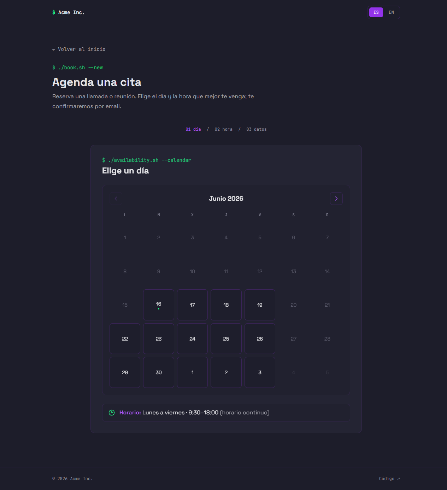
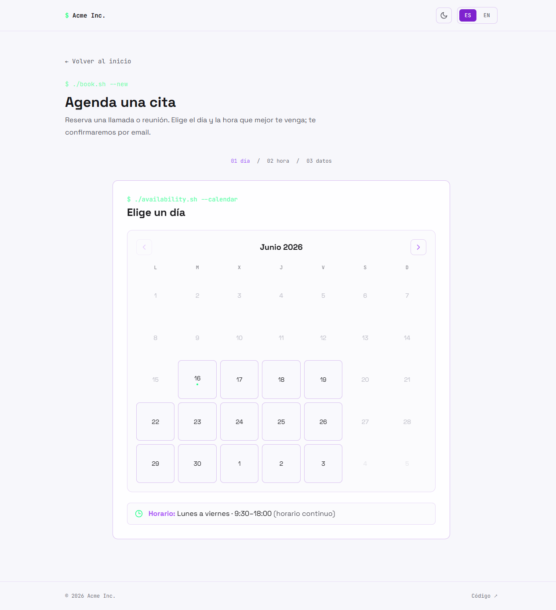

# Meetcita

**[ES](#español) | [EN](#english)**

[](https://github.com/zeroit789/meetcita/actions/workflows/ci.yml)
[](LICENSE)




---

## Español

- [Qué es](#qué-es)
- [Funcionalidades](#funcionalidades)
- [Capturas](#capturas)
- [Stack tecnológico](#stack-tecnológico)
- [Requisitos](#requisitos)
- [Instalación](#instalación)
- [Configuración (.env)](#configuración-env)
- [Comandos](#comandos)
- [Rutas](#rutas)
- [Estructura de carpetas](#estructura-de-carpetas)
- [Google Calendar + Meet (opcional)](#google-calendar--meet-opcional)
- [Bot de Telegram (opcional)](#bot-de-telegram-opcional)
- [Despliegue en producción](#despliegue-en-producción)
- [Personalización](#personalización)
- [Tests e integración continua](#tests-e-integración-continua)
- [Limitaciones conocidas](#limitaciones-conocidas)
- [Licencia](#licencia)
- [Créditos](#créditos)

### Qué es

Meetcita es un sistema de **reserva de citas** open source y autoalojado, hecho con Laravel y Livewire. El cliente elige día, duración y hora en un asistente de cuatro pasos. Tú recibes el aviso por email y, si lo configuras, por Telegram, y confirmas o rechazas desde el móvil o desde un panel web con contraseña. Las citas online confirmadas se crean en tu Google Calendar con enlace de Google Meet.

Salió del módulo de citas de [danimefle.com](https://danimefle.com) y se publicó como proyecto independiente: es una aplicación Laravel completa que se clona, se configura con el `.env` y funciona.

### Funcionalidades

Todo lo de esta lista existe en el código actual:

- **Asistente de reserva en 4 pasos** (`/citas`, componente Livewire `BookAppointment`):
  1. Día, en un calendario mensual.
  2. Duración (30 o 60 minutos) y hora libre.
  3. Datos: modalidad, nombre, email, teléfono (opcional), personas que asisten, emails de invitados (opcional, hasta `APPOINTMENTS_MAX_ATTENDEES`) y mensaje.
  4. Pantalla final con el código público de la cita (por ejemplo `APT-K7P3Q`).
- **Disponibilidad real** (`AvailabilityService`): ofrece los próximos N días laborables (`APPOINTMENTS_DAYS_AHEAD`) con huecos de 30 minutos entre la apertura y el cierre. Quita las horas ya pasadas (en la zona horaria del negocio), los días bloqueados, las citas no canceladas y, si Google está configurado, los eventos de tu propio Google Calendar. Una cita de 60 minutos ocupa dos huecos seguidos y nunca termina después del cierre.
- **Sin dobles reservas**: bloqueo por día (`Cache::lock`), transacción que vuelve a comprobar el hueco y, en SQLite y PostgreSQL, un índice único parcial sobre `(date, time)` para las citas no canceladas.
- **Antispam**: campo trampa (honeypot) y un máximo de 5 reservas por hora e IP.
- **Online o presencial**: tú eliges qué modalidades se ofrecen. Las online reciben enlace de Meet al confirmarse (si Google está configurado).
- **Emails en cola** (los cuatro Mailables implementan `ShouldQueue`):
  - al dueño: nueva solicitud;
  - al cliente: solicitud recibida, con botones para añadirla al calendario;
  - al cliente: cita confirmada, con enlace de Meet, botón de Google Calendar y descarga `.ics`;
  - al cliente: cita rechazada o cancelada, con el motivo que escribes en Telegram o en el panel (en el panel es opcional).
  
  Los invitados extra van en copia y los emails al cliente salen en su idioma.
- **Bot de Telegram** (opcional): cada reserva llega con dos botones, **✅ Confirm** y **❌ Reject**. Al rechazar, el bot te pide el motivo y tu siguiente mensaje (en menos de 15 minutos) cancela la cita y se envía al cliente. El webhook exige un secreto (403 si falta o no coincide) y solo atiende al chat del dueño.
- **Panel de administración** (`/panel`): contraseña única compartida (sin tabla de usuarios), máximo 5 intentos de login por minuto e IP. Lista paginada de citas (30 por página) con acciones de **confirmar** (solo las pendientes: email + evento en Google) y **cancelar** (pide un motivo opcional, borra el evento de Google y manda al cliente el email de cancelación). También gestiona los **días bloqueados**, y no deja bloquear un día que ya tiene citas activas.
- **Google Calendar + Meet** (opcional): crea el evento al confirmar, invita al cliente y a los invitados, lo borra al cancelar y lee tus eventos para no ofrecer huecos ocupados.
- **Archivo `.ics`**: `/cita/{reference}/calendario.ics` para Outlook o Apple Calendar (máximo 20 descargas por minuto e IP).
- **Bilingüe ES / EN**: el idioma sale, por este orden, de la cookie del selector (`/lang/{locale}`), del navegador en la primera visita (cabecera `Accept-Language`; `en-US` cuenta como `en`) y, si ninguno encaja, de `default_locale` en `config/appointments.php`. Cada cita guarda el idioma del cliente para sus emails.
- **Tema claro y oscuro**, con botón sol/luna que recuerda la elección. El tema por defecto se fija con `APPOINTMENTS_THEME`.
- **Todo configurable** desde `config/appointments.php` y el `.env`: marca, horario, días laborables, duraciones, modalidades, zona horaria, prefijo del código y tema.
- **Funciona sin Google ni Telegram**: sin ellos las reservas siguen funcionando y se gestionan desde el panel, aunque no habrá enlace de Meet automático.

### Capturas


*Asistente de reserva (`/citas`), tema oscuro.*


*El mismo asistente en tema claro.*

### Stack tecnológico

Versiones exactas del `composer.lock` y del `pnpm-lock.yaml`:

| Pieza | Versión |
|---|---|
| PHP | ≥ 8.4.1 (lo exigen las dependencias de Symfony 8 del lockfile) |
| laravel/framework | 13.33.0 |
| livewire/livewire | 4.4.6 |
| google/apiclient | 2.20.0 |
| laravel/tinker | 3.0.2 |
| laravel/pint (dev) | 1.32.1 |
| phpunit/phpunit (dev) | 12.5.35 |
| laravel/pail (dev) | 1.2.7 |
| tailwindcss / @tailwindcss/vite | 4.3.3 |
| vite | 8.3.0 |
| laravel-vite-plugin | 3.2.0 |
| concurrently (dev) | 9.2.4 |

Base de datos: SQLite por defecto. También funciona con PostgreSQL y MySQL/MariaDB (ver [Limitaciones conocidas](#limitaciones-conocidas)).

### Requisitos

- **PHP 8.4.1 o superior**, con las extensiones habituales de Laravel y el driver PDO de tu base de datos (`pdo_sqlite` para la configuración por defecto).
- **Composer 2**.
- **Node.js 20.19+ o 22.12+** (lo pide Vite 8) y **pnpm** (la versión está fijada en `packageManager` de `package.json`; con Corepack basta `corepack enable`) para compilar el CSS y el JS.
- Opcional: un proyecto de **Google Cloud** (Calendar + Meet) y un **bot de Telegram**.

### Instalación

```bash
# 1. Clona el repositorio
git clone https://github.com/zeroit789/meetcita.git meetcita
cd meetcita

# 2. Dependencias PHP
composer install

# 3. Crea el .env a partir del ejemplo y genera la clave
cp .env.example .env
php artisan key:generate

# 4. Crea la base de datos SQLite (driver por defecto)
#    En PowerShell: New-Item database/database.sqlite -ItemType File
touch database/database.sqlite

# 5. Crea las tablas
php artisan migrate

# 6. Dependencias del front y compilación de assets
pnpm install
pnpm run build

# 7. Arranca el servidor
php artisan serve
```

Abre **http://localhost:8000/citas** para reservar y **http://localhost:8000/panel** para el panel. Antes de entrar al panel pon una contraseña en `APPOINTMENTS_PANEL_PASSWORD`.

Sin `pnpm run build` las páginas dan error 500, porque falta el manifiesto de Vite.

### Configuración (.env)

`.env.example` trae todas las variables comentadas. Ninguna de las propias es obligatoria para arrancar, pero sin contraseña no se puede entrar al panel. Los valores se leen en `config/appointments.php` y `config/services.php`.

| Variable | Qué hace | Ejemplo |
|---|---|---|
| `APP_NAME` | Nombre de la app (remitente de los emails). | `"Appointments"` |
| `APP_ENV` / `APP_DEBUG` | Entorno y errores detallados. En producción: `production` y `false`. | `local` / `true` |
| `APP_URL` | URL pública. En producción, tu dominio HTTPS (la usa el webhook de Telegram). | `http://localhost` |
| `APP_LOCALE` | Idioma interno de Laravel (mensajes del framework). No decide el idioma de la web de reservas: ese sale de la cookie del selector, del navegador o de `default_locale` en `config/appointments.php`. | `es` |
| `DB_CONNECTION` | `sqlite`, `pgsql` o `mysql`. | `sqlite` |
| `SESSION_DRIVER` / `QUEUE_CONNECTION` / `CACHE_STORE` | Todo en base de datos por defecto (sesión del panel, cola de emails, locks y caché). | `database` |
| `MAIL_MAILER` / `MAIL_FROM_ADDRESS` | Transporte y remitente. `log` escribe los emails en el log. | `log` |
| `APPOINTMENTS_BRAND` | Nombre de tu marca (emails y eventos). | `"Acme Inc."` |
| `APPOINTMENTS_OWNER_NAME` / `APPOINTMENTS_OWNER_ROLE` | Nombre y cargo de la firma de los emails. | `"Jane Doe"` / `"Founder"` |
| `APPOINTMENTS_OWNER_EMAIL` | Recibe los avisos de nueva cita y es el Reply-To. | `"hello@example.com"` |
| `APPOINTMENTS_WEBSITE` / `APPOINTMENTS_LINKEDIN` | Enlaces de la firma. LinkedIn vacío = oculto. | `"https://example.com"` |
| `APPOINTMENTS_REF_PREFIX` | Prefijo del código de cita (2-4 letras). | `APT` |
| `APPOINTMENTS_TIMEZONE` | Zona horaria del negocio. Todas las horas se calculan en ella. | `Europe/Madrid` |
| `APPOINTMENTS_DAYS_AHEAD` | Días laborables que se ofrecen. | `14` |
| `APPOINTMENTS_OPEN` / `APPOINTMENTS_CLOSE` | Apertura y cierre (el cierre es exclusivo). | `09:30` / `18:00` |
| `APPOINTMENTS_MAX_ATTENDEES` | Máximo de emails de invitados por cita. | `10` |
| `APPOINTMENTS_MODALITY_ONLINE` / `APPOINTMENTS_MODALITY_IN_PERSON` | Modalidades ofrecidas (al menos una a `true`). | `true` |
| `APPOINTMENTS_PANEL_PASSWORD` | Contraseña de `/panel`. No tiene valor por defecto. | *(vacía: ponla tú)* |
| `APPOINTMENTS_THEME` | Tema por defecto: `dark`, `light` o `auto`. | `dark` |
| `GOOGLE_CLIENT_ID` / `GOOGLE_CLIENT_SECRET` | Credenciales OAuth de Google (opcional). | *(vacío)* |
| `GOOGLE_REFRESH_TOKEN` | Lo da `php artisan google:auth`. | *(vacío)* |
| `GOOGLE_CALENDAR_ID` / `GOOGLE_REDIRECT_URI` | Calendario destino y URI de redirección OAuth. | `primary` / `http://localhost` |
| `TELEGRAM_BOT_TOKEN` / `TELEGRAM_CHAT_ID` | Bot y chat donde llegan los avisos (opcional). | *(vacío)* |
| `TELEGRAM_WEBHOOK_SECRET` | Cadena aleatoria que protege el webhook. Obligatoria si usas el bot. | *(vacío)* |

Lo que no está en el `.env` se cambia en `config/appointments.php`: duración del hueco (`slot_minutes`, 30), duraciones ofrecidas (`durations`, `[30, 60]`), días laborables (`weekdays`, ISO 1 = lunes … 7 = domingo, por defecto de lunes a viernes) e idiomas (`locales`, `default_locale`).

### Comandos

| Comando | Para qué |
|---|---|
| `composer dev` | Servidor, cola, logs (Pail) y Vite a la vez. |
| `composer test` / `php artisan test` | Tests con PHPUnit (ver [Tests e integración continua](#tests-e-integración-continua)). |
| `./vendor/bin/pint` | Formato del código PHP (preset de Laravel). |
| `pnpm run dev` / `pnpm run build` | Vite en desarrollo / compilación para producción. |
| `php artisan google:auth` | Paso 1 del OAuth de Google: imprime la URL de autorización. |
| `php artisan google:auth --code=CODIGO` | Paso 2: canjea el código e imprime el `GOOGLE_REFRESH_TOKEN`. |
| `php artisan telegram:set-webhook [--url=...]` | Registra el webhook del bot (por defecto `APP_URL/telegram/webhook`). |
| `php artisan telegram:test` | Envía un mensaje de prueba a tu chat. |
| `php artisan schedule:work` | Ejecuta el scheduler en primer plano (procesa la cola de emails cada minuto). |

### Rutas

| Método | Ruta | Qué hace |
|---|---|---|
| GET | `/` | Página de inicio de demostración. |
| GET | `/citas` | Asistente de reserva. |
| GET | `/lang/{locale}` | Cambia el idioma (`es` / `en`). |
| GET | `/cita/{reference}/calendario.ics` | Descarga el `.ics` de una cita. |
| POST | `/telegram/webhook` | Webhook del bot (sin CSRF, protegido por secreto). |
| GET / POST | `/panel/login` | Login del panel. |
| POST | `/panel/logout` | Cerrar sesión del panel. |
| GET | `/panel` | Panel de citas y días bloqueados. |
| GET | `/up` | Health check de Laravel. |

### Estructura de carpetas

```text
app/
├── Console/Commands/    google:auth, telegram:set-webhook, telegram:test
├── Http/Controllers/    PanelController, AppointmentIcsController, TelegramWebhookController
├── Http/Middleware/     AdminPanelPassword (panel), SetLocale (idioma)
├── Livewire/            BookAppointment (asistente), PanelCitas, PanelBlockedDays
├── Mail/                los 4 emails de la cita (en cola)
├── Models/              Appointment, BlockedDay, User (del esqueleto, sin uso)
└── Services/            AvailabilityService, GoogleCalendarService, TelegramNotifier
bootstrap/app.php        middleware, proxy de confianza, CSRF del webhook
config/appointments.php  configuración del sistema de citas
config/services.php      credenciales de Telegram y Google
database/migrations/     tablas base de Laravel + appointments + blocked_days
docs/                    GOOGLE.md, TELEGRAM.md e img/
lang/{es,en}/            citas.php (interfaz) y emails.php (correos)
resources/css/app.css    Tailwind 4 y temas (sección RE-THEME)
resources/js/app.js      botón de tema claro/oscuro
resources/views/         layouts, asistente, panel y plantillas de email
routes/web.php           rutas web
routes/console.php       worker de la cola programado cada minuto
tests/                   tests unitarios (servicios, modelo) y de funcionalidad (reservas, panel, Telegram, idioma, emails)
.github/workflows/ci.yml integración continua (GitHub Actions)
```

### Google Calendar + Meet (opcional)

Con Google conectado, cada cita confirmada se crea en tu calendario (con Meet si es online), se borra al cancelarla y tus eventos bloquean los huecos en los que ya estás ocupado. Sin Google todo sigue funcionando, solo que sin sincronización ni Meet automático.

Guía paso a paso: [docs/GOOGLE.md](docs/GOOGLE.md).

### Bot de Telegram (opcional)

El bot te avisa de cada reserva con los botones **✅ Confirm** y **❌ Reject**. Las etiquetas de los botones están en inglés y los mensajes del bot, en español. Sin bot, todo se gestiona desde `/panel`.

Guía paso a paso: [docs/TELEGRAM.md](docs/TELEGRAM.md).

### Despliegue en producción

1. `APP_ENV=production`, `APP_DEBUG=false` y `APP_URL` con tu dominio HTTPS.
2. `composer install --no-dev --optimize-autoloader`, `pnpm install --frozen-lockfile` y `pnpm run build`.
3. `php artisan migrate --force`.
4. **Cola de emails**: los emails se encolan, así que hay que procesar la cola. `routes/console.php` ya programa `queue:work --stop-when-empty --max-time=55 --tries=3` cada minuto; basta con una entrada de cron para el scheduler:

   ```bash
   * * * * * cd /ruta/al/proyecto && php artisan schedule:run >> /dev/null 2>&1
   ```

   También puedes tener un worker permanente con `php artisan queue:work --tries=3`.
5. **Proxy inverso**: `bootstrap/app.php` solo confía en el proxy de la red `10.0.1.0/24` (la red interna de Coolify en el despliegue original). Si tu proxy está en otra red, cambia ese CIDR. Si no lo cambias, Laravel no verá la IP real ni el HTTPS del cliente, y los límites por IP se aplicarán a la IP del proxy.
6. El webhook de Telegram necesita HTTPS público. Después del despliegue, ejecuta `php artisan telegram:set-webhook`.

### Personalización

- **Marca y comportamiento**: `config/appointments.php` (cada opción está comentada) o su variable del `.env`.
- **Color de acento**: `resources/css/app.css`, sección **RE-THEME** (marcada con ⭐). Por ejemplo, azul: `--accent: #2563eb; --accent-glow: #3b82f6;`. Luego, `pnpm run build`.
- **Textos**: `lang/es/*.php` y `lang/en/*.php`.
- **Página de inicio**: `resources/views/welcome.blade.php` es una demo; cámbiala por la tuya.

### Tests e integración continua

```bash
php artisan test
```

Los tests usan SQLite en memoria, congelan el reloj en un día laborable fijo y apagan Google y Telegram (la API de Google se simula con Mockery y la de Telegram con `Http::fake`), así que no necesitan red ni credenciales:

- **Unitarios** (`tests/Unit`): `AvailabilityService` (días ofrecidos, franjas, inicios de 1 hora, días bloqueados, horas pasadas, ocupación de Google), `GoogleCalendarService` (ventana de consulta, agrupado en medios-slots, fallos) y el modelo `Appointment`.
- **De funcionalidad** (`tests/Feature`): el asistente de reserva (días y franjas, reservar, doble reserva, validación del formulario), el panel (acceso, confirmar, cancelar con motivo, días bloqueados), el webhook de Telegram, el idioma, la descarga `.ics` y el renderizado de los emails.

El workflow `.github/workflows/ci.yml` se ejecuta en cada push y pull request con PHP 8.4 y 8.5: instala dependencias, pasa Pint (`--test`), compila el front con pnpm, lanza los tests y ejecuta `composer audit` y `pnpm audit`. Las actions están fijadas por SHA.

### Limitaciones conocidas

- **MySQL/MariaDB**: no admiten índices parciales, así que ahí no hay índice único en base de datos. La doble reserva la evitan solo el bloqueo y la transacción de la aplicación.
- Los mensajes del bot de Telegram y algunos textos del panel (errores de login) están solo en español.

### Licencia

[MIT](LICENSE) © Daniel Castaños Mefle.

### Créditos

Hecho por **Daniel Castaños Mefle (ZeroIT)**: [danimefle.com](https://danimefle.com).

---

## English

- [What it is](#what-it-is)
- [Features](#features)
- [Screenshots](#screenshots)
- [Tech stack](#tech-stack)
- [Requirements](#requirements)
- [Installation](#installation)
- [Configuration (.env)](#configuration-env)
- [Commands](#commands)
- [Routes](#routes)
- [Folder structure](#folder-structure)
- [Google Calendar + Meet (optional)](#google-calendar--meet-optional)
- [Telegram bot (optional)](#telegram-bot-optional)
- [Production deployment](#production-deployment)
- [Customization](#customization)
- [Tests and CI](#tests-and-ci)
- [Known limitations](#known-limitations)
- [License](#license)
- [Credits](#credits)

### What it is

Meetcita is an open-source, self-hosted **appointment booking system** built with Laravel and Livewire. Clients pick a day, a duration and a time in a four-step wizard. You get notified by email (and by Telegram, if you set it up), then confirm or reject from your phone or from a password-protected web panel. Confirmed online meetings are added to your Google Calendar with a Google Meet link.

It started as the booking module of [danimefle.com](https://danimefle.com) and was released as a standalone project: a complete Laravel app you clone, configure through `.env`, and run.

### Features

Everything below exists in the current code:

- **Four-step booking wizard** (`/citas`, Livewire component `BookAppointment`):
  1. Day, on a monthly calendar.
  2. Duration (30 or 60 minutes) and a free time slot.
  3. Details: meeting type, name, email, phone (optional), who is attending, guest emails (optional, up to `APPOINTMENTS_MAX_ATTENDEES`) and a message.
  4. Final screen with the public booking code (e.g. `APT-K7P3Q`).
- **Real availability** (`AvailabilityService`): offers the next N business days (`APPOINTMENTS_DAYS_AHEAD`) in 30-minute slots between opening and closing time. It drops past times (in the business time zone), blocked days, non-cancelled bookings and, when Google is set up, the events on your own Google Calendar. A 60-minute meeting takes two back-to-back slots and never runs past closing time.
- **No double bookings**: a per-day lock (`Cache::lock`), a transaction that re-checks the slot, and, on SQLite and PostgreSQL, a partial unique index on `(date, time)` for non-cancelled bookings.
- **Spam protection**: a honeypot field and a limit of 5 bookings per hour per IP.
- **Online or in person**: you choose which meeting types are offered. Online meetings get a Meet link once confirmed (when Google is set up).
- **Queued emails** (all four Mailables implement `ShouldQueue`):
  - to the owner: new request;
  - to the client: request received, with add-to-calendar buttons;
  - to the client: booking confirmed, with the Meet link, a Google Calendar button and an `.ics` download;
  - to the client: booking rejected or cancelled, with the reason you typed in Telegram or in the panel (optional in the panel).

  Extra guests are CC'd, and client emails go out in the client's language.
- **Telegram bot** (optional): every booking arrives with two buttons, **✅ Confirm** and **❌ Reject**. On reject, the bot asks for a reason, and your next message (within 15 minutes) cancels the booking and is emailed to the client. The webhook requires a secret (403 if it's missing or wrong) and only responds to the owner's chat.
- **Admin panel** (`/panel`): a single shared password (no users table), with at most 5 login attempts per minute per IP. Paginated booking list (30 per page) with **confirm** (pending bookings only: email + Google event) and **cancel** (asks for an optional reason, deletes the Google event and emails the client the cancellation) actions. It also manages **blocked days** and won't block a day that already has active bookings.
- **Google Calendar + Meet** (optional): creates the event on confirmation, invites the client and guests, deletes it on cancellation, and reads your events so busy times aren't offered.
- **`.ics` file**: `/cita/{reference}/calendario.ics` for Outlook or Apple Calendar (at most 20 downloads per minute per IP).
- **Bilingual ES / EN**: the language comes, in this order, from the switcher cookie (`/lang/{locale}`), from the browser on the first visit (`Accept-Language` header; `en-US` counts as `en`) and, if nothing matches, from `default_locale` in `config/appointments.php`. Each booking stores the client's language for its emails.
- **Light and dark themes**, with a sun/moon toggle that remembers the choice. The default theme is set with `APPOINTMENTS_THEME`.
- **Fully configurable** through `config/appointments.php` and `.env`: branding, hours, business days, durations, meeting types, time zone, booking code prefix and theme.
- **Works without Google or Telegram**: bookings still work and you manage them from the panel; you just don't get automatic Meet links.

### Screenshots


*Booking wizard (`/citas`), dark theme.*


*The same wizard in light theme.*

### Tech stack

Exact versions from `composer.lock` and `pnpm-lock.yaml`:

| Component | Version |
|---|---|
| PHP | ≥ 8.4.1 (required by the Symfony 8 packages in the lockfile) |
| laravel/framework | 13.33.0 |
| livewire/livewire | 4.4.6 |
| google/apiclient | 2.20.0 |
| laravel/tinker | 3.0.2 |
| laravel/pint (dev) | 1.32.1 |
| phpunit/phpunit (dev) | 12.5.35 |
| laravel/pail (dev) | 1.2.7 |
| tailwindcss / @tailwindcss/vite | 4.3.3 |
| vite | 8.3.0 |
| laravel-vite-plugin | 3.2.0 |
| concurrently (dev) | 9.2.4 |

Database: SQLite by default. PostgreSQL and MySQL/MariaDB also work (see [Known limitations](#known-limitations)).

### Requirements

- **PHP 8.4.1 or later**, with the usual Laravel extensions and the PDO driver for your database (`pdo_sqlite` for the default setup).
- **Composer 2**.
- **Node.js 20.19+ or 22.12+** (required by Vite 8) and **pnpm** (the version is pinned in `packageManager` in `package.json`; with Corepack, `corepack enable` is enough) to build the CSS and JS.
- Optional: a **Google Cloud** project (Calendar + Meet) and a **Telegram bot**.

### Installation

```bash
# 1. Clone the repository
git clone https://github.com/zeroit789/meetcita.git meetcita
cd meetcita

# 2. PHP dependencies
composer install

# 3. Create .env from the example and generate the app key
cp .env.example .env
php artisan key:generate

# 4. Create the SQLite database (default driver)
#    In PowerShell: New-Item database/database.sqlite -ItemType File
touch database/database.sqlite

# 5. Create the tables
php artisan migrate

# 6. Front-end dependencies and asset build
pnpm install
pnpm run build

# 7. Start the server
php artisan serve
```

Open **http://localhost:8000/citas** to book and **http://localhost:8000/panel** for the panel. Set `APPOINTMENTS_PANEL_PASSWORD` before logging in to the panel.

Without `pnpm run build`, pages return a 500 error because the Vite manifest is missing.

### Configuration (.env)

`.env.example` lists every variable with comments. None of the project's own variables are required to boot, but you can't log in to the panel without a password. Values are read in `config/appointments.php` and `config/services.php`.

| Variable | What it does | Example |
|---|---|---|
| `APP_NAME` | App name (email sender name). | `"Appointments"` |
| `APP_ENV` / `APP_DEBUG` | Environment and detailed errors. In production: `production` and `false`. | `local` / `true` |
| `APP_URL` | Public URL. In production, your HTTPS domain (the Telegram webhook uses it). | `http://localhost` |
| `APP_LOCALE` | Laravel's internal locale (framework messages). It does not decide the booking site language: that comes from the switcher cookie, the browser or `default_locale` in `config/appointments.php`. | `es` |
| `DB_CONNECTION` | `sqlite`, `pgsql` or `mysql`. | `sqlite` |
| `SESSION_DRIVER` / `QUEUE_CONNECTION` / `CACHE_STORE` | All database-backed by default (panel session, email queue, locks and cache). | `database` |
| `MAIL_MAILER` / `MAIL_FROM_ADDRESS` | Mail transport and sender. `log` writes emails to the log. | `log` |
| `APPOINTMENTS_BRAND` | Your brand name (emails and events). | `"Acme Inc."` |
| `APPOINTMENTS_OWNER_NAME` / `APPOINTMENTS_OWNER_ROLE` | Name and title in the email signature. | `"Jane Doe"` / `"Founder"` |
| `APPOINTMENTS_OWNER_EMAIL` | Gets the new-booking alerts and is used as Reply-To. | `"hello@example.com"` |
| `APPOINTMENTS_WEBSITE` / `APPOINTMENTS_LINKEDIN` | Signature links. Empty LinkedIn = hidden. | `"https://example.com"` |
| `APPOINTMENTS_REF_PREFIX` | Booking code prefix (2-4 letters). | `APT` |
| `APPOINTMENTS_TIMEZONE` | Business time zone. All times are computed in it. | `Europe/Madrid` |
| `APPOINTMENTS_DAYS_AHEAD` | Number of business days offered. | `14` |
| `APPOINTMENTS_OPEN` / `APPOINTMENTS_CLOSE` | Opening and closing time (closing is exclusive). | `09:30` / `18:00` |
| `APPOINTMENTS_MAX_ATTENDEES` | Max guest emails per booking. | `10` |
| `APPOINTMENTS_MODALITY_ONLINE` / `APPOINTMENTS_MODALITY_IN_PERSON` | Meeting types offered (at least one must be `true`). | `true` |
| `APPOINTMENTS_PANEL_PASSWORD` | Password for `/panel`. There is no default. | *(empty: set one)* |
| `APPOINTMENTS_THEME` | Default theme: `dark`, `light` or `auto`. | `dark` |
| `GOOGLE_CLIENT_ID` / `GOOGLE_CLIENT_SECRET` | Google OAuth credentials (optional). | *(empty)* |
| `GOOGLE_REFRESH_TOKEN` | Printed by `php artisan google:auth`. | *(empty)* |
| `GOOGLE_CALENDAR_ID` / `GOOGLE_REDIRECT_URI` | Target calendar and OAuth redirect URI. | `primary` / `http://localhost` |
| `TELEGRAM_BOT_TOKEN` / `TELEGRAM_CHAT_ID` | Bot and chat that receives the alerts (optional). | *(empty)* |
| `TELEGRAM_WEBHOOK_SECRET` | Random string that protects the webhook. Required if you use the bot. | *(empty)* |

Anything not in `.env` is changed in `config/appointments.php`: slot length (`slot_minutes`, 30), offered durations (`durations`, `[30, 60]`), business days (`weekdays`, ISO 1 = Monday … 7 = Sunday, Monday to Friday by default) and languages (`locales`, `default_locale`).

### Commands

| Command | What it's for |
|---|---|
| `composer dev` | Server, queue, logs (Pail) and Vite together. |
| `composer test` / `php artisan test` | PHPUnit tests (see [Tests and CI](#tests-and-ci)). |
| `./vendor/bin/pint` | PHP code formatting (Laravel preset). |
| `pnpm run dev` / `pnpm run build` | Vite dev server / production build. |
| `php artisan google:auth` | Google OAuth step 1: prints the authorization URL. |
| `php artisan google:auth --code=CODE` | Step 2: exchanges the code and prints `GOOGLE_REFRESH_TOKEN`. |
| `php artisan telegram:set-webhook [--url=...]` | Registers the bot webhook (defaults to `APP_URL/telegram/webhook`). |
| `php artisan telegram:test` | Sends a test message to your chat. |
| `php artisan schedule:work` | Runs the scheduler in the foreground (processes the email queue every minute). |

### Routes

| Method | Path | What it does |
|---|---|---|
| GET | `/` | Demo home page. |
| GET | `/citas` | Booking wizard. |
| GET | `/lang/{locale}` | Switches the language (`es` / `en`). |
| GET | `/cita/{reference}/calendario.ics` | Downloads a booking's `.ics`. |
| POST | `/telegram/webhook` | Bot webhook (no CSRF, protected by a secret). |
| GET / POST | `/panel/login` | Panel login. |
| POST | `/panel/logout` | Panel logout. |
| GET | `/panel` | Bookings and blocked days panel. |
| GET | `/up` | Laravel health check. |

### Folder structure

```text
app/
├── Console/Commands/    google:auth, telegram:set-webhook, telegram:test
├── Http/Controllers/    PanelController, AppointmentIcsController, TelegramWebhookController
├── Http/Middleware/     AdminPanelPassword (panel), SetLocale (language)
├── Livewire/            BookAppointment (wizard), PanelCitas, PanelBlockedDays
├── Mail/                the 4 booking emails (queued)
├── Models/              Appointment, BlockedDay, User (from the skeleton, unused)
└── Services/            AvailabilityService, GoogleCalendarService, TelegramNotifier
bootstrap/app.php        middleware, trusted proxy, webhook CSRF exemption
config/appointments.php  booking system settings
config/services.php      Telegram and Google credentials
database/migrations/     Laravel base tables + appointments + blocked_days
docs/                    GOOGLE.md, TELEGRAM.md and img/
lang/{es,en}/            citas.php (UI) and emails.php (emails)
resources/css/app.css    Tailwind 4 and themes (RE-THEME section)
resources/js/app.js      light/dark theme toggle
resources/views/         layouts, wizard, panel and email templates
routes/web.php           web routes
routes/console.php       queue worker scheduled every minute
tests/                   unit tests (services, model) and feature tests (booking, panel, Telegram, language, emails)
.github/workflows/ci.yml continuous integration (GitHub Actions)
```

### Google Calendar + Meet (optional)

With Google connected, every confirmed booking is added to your calendar (with Meet if it's online), removed when cancelled, and your own events block the times you're already busy. Without Google everything still works, just without calendar sync or automatic Meet links.

Step-by-step guide: [docs/GOOGLE.md](docs/GOOGLE.md).

### Telegram bot (optional)

The bot pings you for every booking with **✅ Confirm** and **❌ Reject** buttons. The button labels are in English; the bot's messages are in Spanish. Without the bot, you manage everything from `/panel`.

Step-by-step guide: [docs/TELEGRAM.md](docs/TELEGRAM.md).

### Production deployment

1. Set `APP_ENV=production`, `APP_DEBUG=false` and `APP_URL` to your HTTPS domain.
2. Run `composer install --no-dev --optimize-autoloader`, `pnpm install --frozen-lockfile` and `pnpm run build`.
3. Run `php artisan migrate --force`.
4. **Email queue**: emails are queued, so something has to process the queue. `routes/console.php` already schedules `queue:work --stop-when-empty --max-time=55 --tries=3` every minute, so a single cron entry for the scheduler is enough:

   ```bash
   * * * * * cd /path/to/project && php artisan schedule:run >> /dev/null 2>&1
   ```

   You can also run a long-lived worker with `php artisan queue:work --tries=3`.
5. **Reverse proxy**: `bootstrap/app.php` only trusts a proxy on `10.0.1.0/24` (Coolify's internal network in the original deployment). If your proxy lives on another network, change that CIDR. Otherwise Laravel won't see the client's real IP or HTTPS, and per-IP limits will apply to the proxy's IP.
6. The Telegram webhook needs public HTTPS. After deploying, run `php artisan telegram:set-webhook`.

### Customization

- **Branding and behavior**: `config/appointments.php` (every option is commented) or its `.env` variable.
- **Accent color**: `resources/css/app.css`, **RE-THEME** section (marked with ⭐). For example, blue: `--accent: #2563eb; --accent-glow: #3b82f6;`. Then run `pnpm run build`.
- **Copy**: `lang/es/*.php` and `lang/en/*.php`.
- **Home page**: `resources/views/welcome.blade.php` is a demo; replace it with your own.

### Tests and CI

```bash
php artisan test
```

The tests use in-memory SQLite, freeze the clock on a fixed business day and turn Google and Telegram off (the Google API is mocked with Mockery and Telegram's with `Http::fake`), so they need no network or credentials:

- **Unit** (`tests/Unit`): `AvailabilityService` (offered days, slots, one-hour starts, blocked days, past times, Google occupancy), `GoogleCalendarService` (query window, half-slot grouping, failures) and the `Appointment` model.
- **Feature** (`tests/Feature`): the booking wizard (days and slots, booking, double booking, form validation), the panel (access, confirm, cancel with a reason, blocked days), the Telegram webhook, the language, the `.ics` download and email rendering.

The `.github/workflows/ci.yml` workflow runs on every push and pull request with PHP 8.4 and 8.5: it installs dependencies, runs Pint (`--test`), builds the front end with pnpm, runs the tests, and runs `composer audit` and `pnpm audit`. Actions are pinned by SHA.

### Known limitations

- **MySQL/MariaDB**: they don't support partial indexes, so there's no database-level unique index there. Double bookings are prevented only by the app's lock and transaction.
- The Telegram bot's messages and some panel text (login errors) are Spanish-only.

### License

[MIT](LICENSE) © Daniel Castaños Mefle.

### Credits

Built by **Daniel Castaños Mefle (ZeroIT)**: [danimefle.com](https://danimefle.com).
